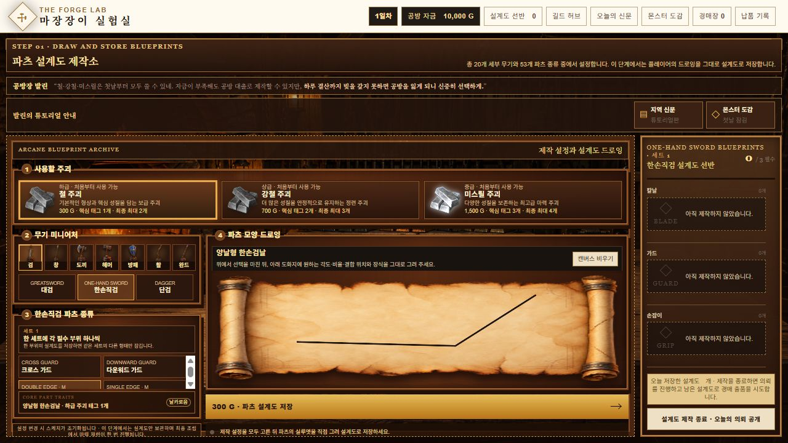
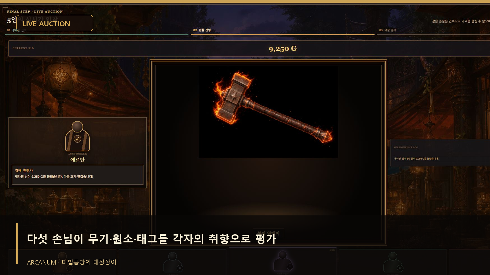

# 마법공방의 대장장이 - 웹게임

플레이어가 무기 파츠를 직접 그리고, 설계도와 원소를 조합해 하나의 무기를 제작하는 판타지 대장장이 웹게임입니다. 팀 프로젝트에서 전체 구현을 담당했으며, 약 3주 동안 개발했습니다.

[게임 플레이](https://arcanum-elemental-forge.chayeongjun0618.chatgpt.site)

- **개발 기간:** 약 3주
- **프로젝트 형태:** 팀 프로젝트
- **담당 역할:** 전체 구현 및 경매장 알고리즘 설계
- **사용 기술:** TypeScript, React, Tailwind CSS, Vite·vinext, Cloudflare Workers, OpenAI 이미지 API
- **플랫폼:** 웹 브라우저

## 게임 소개

플레이어는 대장장이가 되어 재료와 무기 파츠를 선택하고 설계도를 직접 그립니다. 저장한 설계도를 의뢰 조건에 맞게 조합하고 원소를 부여해 무기를 완성합니다. 의뢰와 경매, 재료 비용과 자금 관리가 제작 과정에 연결됩니다.

신문과 몬스터 도감은 의뢰를 판단하는 단서를 제공합니다. 무기의 외형을 직접 그리는 창작 과정과 조건에 맞는 조합을 선택하는 게임 규칙을 함께 구성한 프로젝트입니다.

## 담당 범위

팀 프로젝트의 전체 구현을 담당했습니다. 브라우저의 드로잉·게임 화면, 설계도와 조합 관리, 의뢰 평가·경매·경제 규칙, 이미지 생성 API를 호출하는 서버 처리를 구현 범위에 포함합니다.

## 주요 구현

### 1. 파츠 드로잉과 설계도 관리

주괴 등급, 무기 종류, 파츠 종류를 선택하고 도화지에 파츠의 모양을 그리는 화면을 구현했습니다. 드로잉과 파츠 설정을 설계도로 보관하고, 필요한 부위의 설계도를 모아 최종 조합에 사용하도록 구성했습니다.

이 단계에서는 이미지 생성 API를 호출하지 않고 플레이어가 그린 설계도를 저장합니다.



*배포된 게임에서 파츠 드로잉을 시연한 화면입니다.*

### 2. 여러 설계도를 결합하는 AI 무기 제작

호환되는 설계도 2~4개와 원소를 선택하면 최종 제작 단계에서 서버가 이미지 편집 API를 호출합니다. 선택된 설계도를 한 요청에 전달하여 파츠 구현과 결합, 원소 효과를 함께 반영하도록 구성했습니다.

요청에는 드로잉의 방향·윤곽·비율과 무기별 재질을 유지하기 위한 조건을 포함합니다. 이 조건은 이미지 생성 지침이며, 모든 생성 결과가 의도와 정확히 일치함을 보장하는 것은 아닙니다.

### 3. 제작 대기 중 미니게임

AI 이미지 생성 응답을 기다리는 동안 선택한 설계도를 이용한 도안 압형 미니게임을 제공하도록 구성했습니다. 이미지 생성 대기와 플레이어의 제작 행동을 연결하는 기능입니다.

### 4. 의뢰 평가·원소·경제 규칙

의뢰의 요구 태그와 제작 결과를 비교하고, 주괴 등급과 원소 조건을 평가에 반영하는 규칙을 구현했습니다. 의뢰 보상과 재료 비용을 게임 자금에 연결하고, 경매 입찰과 가격 계산을 별도 규칙으로 구성했습니다.

경매는 게임 내 시뮬레이션이며 실제 사용자 간 거래 서비스로 소개하지 않습니다.

### 5. 서버 API와 콘텐츠 연동

최종 무기 제작 요청을 서버에서 처리하고, 외부 이미지 API의 오류와 시간 초과에 대응하는 응답 처리를 구성했습니다. API 키는 브라우저에 포함하지 않고 서버의 비밀 환경변수를 통해 사용하도록 분리했습니다.

의뢰 후속 콘텐츠를 CSV 형태로 읽고 정리하는 서버 경로도 구성하여 콘텐츠 데이터와 게임 화면을 연결했습니다.

## 직접 설계한 경매장 알고리즘



*프로젝트의 기존 시연 자료에 수록된 경매 진행 화면입니다. 영상용 설명 자막이 포함되어 있습니다.*

### 손님별 숨겨진 선호도

경매에는 5명의 손님이 참여하며, 각자 선호하는 무기 종류와 원소를 가집니다. 선호 무기의 태그와 원소 태그를 입찰 확률에 반영하고, 플레이어에게 정확한 선호도는 공개하지 않습니다.

### 무기 가치와 시작가격

무기의 기본가는 재료비, 파츠 수, 태그 수와 원소 가치를 합산해 계산합니다. 경매 시작가는 레벨별 최소 시작가에 품질 감정가를 더해 결정합니다.

```text
품질 감정가 = 무기 기본가 × 레벨별 감정 배율 × 25% (100G 단위 올림)
경매 시작가 = 레벨별 최소 시작가 + 품질 감정가
```

### 입찰 확률과 가격 부담

손님의 초기 입찰 확률은 경매장 기본 확률에 일치 태그당 10%p를 더하고, 최대 100%로 제한합니다. 태그는 중복 개수를 고려해 일치 여부를 계산합니다.

성공·실패와 관계없이 해당 손님이 입찰을 시도할 때마다 보유 확률을 5%p 낮춥니다. 여기에 시작가 대비 현재 가격의 상승 정도에 따른 확률 감소를 추가합니다.

```text
초기 확률 = min(100%, 기본 확률 + 일치 태그 수 × 10%p)
가격 부담 = floor(max(0, 현재가 ÷ 시작가 − 1) × 레벨별 감소 계수)
실제 입찰 확률 = max(0%, 보유 확률 − 가격 부담)
```

감소 계수는 1레벨 50, 2레벨 40, 3레벨 35입니다. 높은 레벨일수록 같은 가격 상승에도 입찰 확률이 덜 감소합니다.

### 참여 기회 분배와 종료 조건

1. 직전 입찰 성공자와 실제 입찰 확률이 0인 손님을 후보에서 제외합니다.
2. 남은 후보 중 입찰 시도 횟수가 가장 적은 손님들을 추립니다.
3. 이들 중 한 명을 무작위로 선택하고 확률에 따라 성공 여부를 결정합니다.
4. 성공하면 가격과 최고 입찰자를 갱신하고, 성공 여부와 관계없이 시도 횟수와 확률을 갱신합니다.

이 방식으로 같은 손님의 연속 가격 갱신을 막고 여러 손님에게 입찰 기회를 배분합니다. 참여 가능한 후보가 없으면 종료하며, 최대 120회 시도 제한을 둡니다. 성공한 입찰이 없으면 유찰로 처리합니다.

캠페인 시드, 날짜, 출품 ID와 경매장 레벨을 이용한 난수 생성으로 동일한 입력 조건의 경매 결과를 재현할 수 있도록 구성했습니다.

### 가격 상승 분포

| 발생 확률 | 현재 가격 대비 상승률 |
|---|---|
| 70% | 5~10% |
| 25% | 30~50% |
| 5% | 150~200% |

선택한 구간 안에서 상승률을 무작위로 결정하고, `현재 가격 × (1 + 상승률)`을 10G 단위로 올림합니다. 150% 상승은 기존 가격의 2.5배를 의미합니다. 낙찰가의 고정 상한 대신 가격 부담과 확률 감소로 입찰 참여를 제어합니다.

### 경매장 업그레이드와 비용

업그레이드는 다음 날 적용됩니다. 레벨 상승에 따라 최소 시작가·감정 배율·기본 입찰 확률이 높아지고 판매 수수료가 낮아집니다.

| 레벨 | 경매장 | 최소 시작가 | 감정 배율 | 기본 입찰 확률 | 판매 수수료 | 출품 등록비 |
|---|---|---|---|---|---|---|
| 1 | 시장 | 8,000G | 1배 | 35% | 10% | 5,000G |
| 2 | 길드 경매장 | 25,000G | 1.5배 | 45% | 7% | 10,000G |
| 3 | 왕실 경매장 | 60,000G | 2배 | 55% | 5% | 15,000G |

2레벨 업그레이드 비용은 20,000G, 3레벨은 60,000G입니다. 판매 수수료는 낙찰가 기준으로 계산해 10G 단위로 올림하며, 출품 등록비와 별도로 처리합니다.

### 설계 의도

손님의 숨겨진 선호도와 무기 태그를 연결해 제작 결과가 경매에 영향을 주도록 했습니다. 시도 횟수에 따른 기회 배분과 확률 감소, 가격 부담을 함께 적용해 경매 흐름을 제어했습니다. 드문 큰 폭의 가격 상승과 다음 날 적용되는 업그레이드로 제작 이후에도 자금 운용을 선택하는 재미를 구성했습니다.

## 구조

```text
플레이어 드로잉
    ↓
파츠 설계도 저장
    ↓
의뢰·경매에 사용할 설계도와 원소 선택
    ↓
서버의 최종 무기 제작 API
    ↓
OpenAI 이미지 편집 API
    ↓
생성된 무기 표시와 게임 진행
```

- 화면과 플레이 흐름: React·TypeScript
- 게임 규칙: 의뢰 태그 평가, 원소 조건, 가격·경매 계산
- 서버 처리: Cloudflare Worker의 제작 API와 콘텐츠 조회 API
- 배포: Sites 플레이 페이지

## 소개의 핵심

드로잉 입력을 이미지 생성 요청에 연결하고, 생성 과정 전후를 설계도 관리·미니게임·의뢰 평가로 구성했습니다. 외부 AI 기능을 게임의 한 단계로 통합한 전체 구현 경험을 보여주는 프로젝트입니다.


## 플레이 링크

[마법공방의 대장장이 - 웹게임 플레이](https://arcanum-elemental-forge.chayeongjun0618.chatgpt.site)


